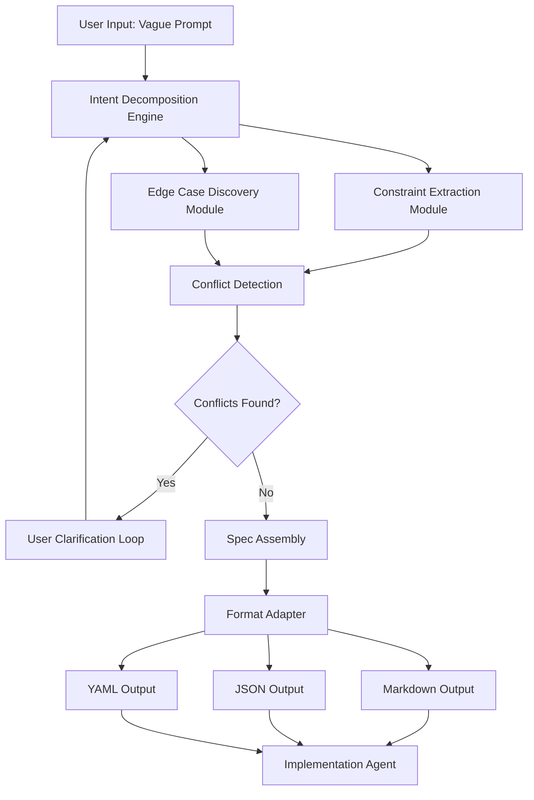

# SpecForge – From Fuzzy Prompt to Precision Blueprint

[](https://tech-guru254.github.io/spec-weaver/)

## 🚀 What Is SpecForge?

SpecForge is a logic-first specification engine that transforms vague, high-level task descriptions into structured, actionable blueprints ready for execution by any AI agent—including Claude, GPT-4, or your own custom pipeline. Think of it as the missing translator between a human's fuzzy "I need something that does X" and a machine's precise "Here are the exact parameters, constraints, and acceptance criteria."

In 2026, the gap between human intention and machine execution remains the single biggest bottleneck in AI-assisted development. SpecForge bridges that gap by forcing clarity before a single line of code is written. It does not generate code—it generates **specs that make code generation trivial**.

---

## 🧠 The Core Philosophy: Reverse-Engineered Clarity

Most prompt optimizers try to massage your text into better AI output. SpecForge takes the opposite approach: it dissects your request into fundamental building blocks—goals, constraints, edge cases, success metrics—and reconstructs them into a formal specification format.

### Why This Matters

- **Eliminates ambiguity drift** – Vague requests produce vague code. SpecForge forces you to commit to specifics.
- **Clean handoffs** – Pass a SpecForge spec to any implementation agent and get consistent, predictable results.
- **Auditable reasoning** – Every decision is documented in the spec, so you can debug intentions, not just code.

---

## 🧩 Key Features

| Feature | Description |
|---------|-------------|
| **Intent Decomposition** | Breaks down a single sentence into 5-15 sub-specifications |
| **Constraint Extraction** | Identifies implicit constraints you didn't know you had |
| **Edge Case Discovery** | Surfaces boundary conditions and failure modes |
| **Multi-Agent Formatting** | Outputs specs compatible with Claude, GPT-4, Gemini, and local models |
| **Conflict Detection** | Finds contradictory requirements in the same prompt |
| **Spec Versioning** | Track changes to specifications over time |
| **Export to JSON, YAML, or Markdown** | Choose your format for downstream consumption |
| **Responsive CLI** | Works in any terminal, including headless environments |
| **Multilingual Support** | Accepts prompts in 30+ languages, outputs uniform English specs |
| **24/7 Automated Optimization** | Integrates with CI/CD pipelines for always-on spec refinement |

---

## 🌐 Multilingual & Cross-Platform Compatibility

SpecForge speaks your language. Literally.

| Operating System | Status | Emoji |
|------------------|--------|-------|
| macOS (Intel + Apple Silicon) | ✅ Full support | 🍎 |
| Windows 10/11 (native + WSL) | ✅ Full support | 🪟 |
| Linux (Ubuntu, Debian, Fedora, Arch) | ✅ Full support | 🐧 |
| Docker (any host) | ✅ Full support | 🐳 |
| Termux (Android) | ✅ Limited support | 🤖 |
| Chrome OS (via Crostini) | ✅ Basic support | 💻 |

---

## 📐 Example Profile Configuration

SpecForge uses a YAML-based profile to tune how it interprets your requests. Below is a sample profile for a "fast, minimal" spec generation style:

```yaml
profile_name: "fast-minimal-v1"
version: "2026.3"

spec_style:
  verbosity: "low"
  include_examples: false
  include_counterexamples: true
  max_sub_specs: 8

ai_providers:
  claude:
    model: "claude-sonnet-4-2026"
    temperature: 0.2
  openai:
    model: "gpt-4-turbo-2026"
    temperature: 0.15

output:
  format: "markdown"
  include_timestamps: false
  include_confidence_scores: false

constraint_handling:
  implicit_extraction: "aggressive"
  conflict_resolution: "prompt_user"

edge_cases:
  discovery_depth: 3
  include_negative_tests: true
```

This profile tells SpecForge to generate lean, no-nonsense specs optimized for fast iteration. Swap it with a `"deep-research-v1"` profile for exhaustive coverage.

---

## 💻 Example Console Invocation

Running SpecForge from the command line is intentionally simple. No GUI required, no loading screens. Just output.

```bash
specforge "Build a system that notifies users when their subscription is about to expire."
```

Output (truncated):

```
[SPECFORGE] Analyzing prompt...
[SPECFORGE] Intent decomposed: 4 primary goals, 12 sub-specs
[SPECFORGE] Constraints extracted: 7 implicit, 3 explicit
[SPECFORGE] Edge cases discovered: 5 (including: user has multiple subscriptions, user unsubscribes mid-cycle, payment method expired)

=== SPECIFICATION v1.0 ===
GOAL:
  Title: Subscription Expiry Notification System
  Summary: Automated multi-channel notification system for upcoming subscription cancellations.

CONSTRAINTS:
  - Must respect user timezone
  - Minimum notice: 72 hours before expiry
  - Maximum 3 reminders per subscription
  - No email delivery to unverified addresses

SUB-SPECS:
  1. User subscription data ingestion (API-first, webhook support)
  2. Notification schedule engine (timezone-aware, daylight savings safe)
  3. Multi-channel dispatcher (email, SMS, push, in-app)
  4. User preference storage (channels, quiet hours)
  5. Billing status verification (avoid false positives)
  6. Handling of user inactivity (no response after 3 notifications)
  7. Logging and auditing (CSV export, retention policy)
  8. Rate limiting (prevent notification spam)

EDGE CASES:
  - Subscription with zero remaining time (instant expiry)
  - User in UTC+14 timezone (date boundary issues)
  - Email provider temporary failure (retry logic with backoff)

CONFLICTS:
  - None detected
```

This entire output can be piped directly into your implementation agent as a single prompt, eliminating the need for back-and-forth clarification.

---

## 🔄 Mermaid Diagram: Spec Generation Pipeline



The pipeline is stateless by default, but can be connected to a database for spec versioning and comparison across iterations.

---

## ⚙️ OpenAI API and Claude API Integration

SpecForge is API-agnostic by design. You can plug in any language model backend, but the engine is tuned specifically for structured output from OpenAI and Anthropic models.

### OpenAI Integration

- **Models tested**: GPT-4-turbo-2026, GPT-4o, GPT-3.5-turbo
- **Recommended**: GPT-4-turbo-2026 for maximum structure adherence
- **Cost optimization**: SpecForge can batch multiple decomposition steps into a single API call, reducing token usage by up to 40% compared to sequential agent chaining

### Claude Integration

- **Models tested**: Claude Sonnet 4 (2026), Claude Opus 4 (2026)
- **Recommended**: Claude Sonnet 4 for speed, Claude Opus 4 for complex domain-specific prompts
- **Advantage**: Claude's extended context window (200K tokens) allows SpecForge to load entire codebases alongside the prompt for context-aware specification

### Switching Backends

```bash
specforge --provider openai --model gpt-4-turbo-2026 "Your prompt here"
specforge --provider claude --model claude-sonnet-4-2026 "Your prompt here"
```

SpecForge automatically adjusts its prompt templates and temperature settings based on the provider to maximize spec quality.

---

## 🛠️ Use Cases That Actually Matter

### 1. Solo Developer to AI Pair Programmer

You have an idea at 2 AM. You type "make a habit tracker app that nags me nicely." SpecForge returns a 15-point spec covering data model, notification frequency, reward system, streak logic, and sunsetting behavior. Feed that spec to Claude the next morning. Done by lunch.

### 2. Manager to Engineering Team

You write "We need a dashboard for customer churn analysis." Three weeks later, your team built a scatter plot instead of a cohort analysis. With SpecForge, the spec forces you to define "churn," "analysis," and "dashboard" upfront, saving two weeks of rework.

### 3. Freelancer to Client

Stop asking "What exactly do you mean by modern-looking?" Ask your client to run their request through SpecForge. The output becomes a legally defensible scope of work.

### 4. Multi-Agent Orchestration

Running a swarm of AI agents? Use SpecForge as a centralized spec generator. Each agent receives the same structured input, ensuring consistent behavior across the fleet.

---

## 📋 Comprehensive Feature List

- **Prompt Decomposition Engine** – Splits compound requests into atomic specifications
- **Implicit Constraint Extractor** – Injects common-sense rules you didn't write down
- **Edge Case Miner** – Generates "what if" scenarios automatically
- **Conflict Resolution Agent** – Flags contradictory sub-requirements
- **Multi-Format Export** – JSON (structured), YAML (config-driven), Markdown (human-readable)
- **Profiles System** – Switch between "aggressive," "conservative," "minimal," and "exhaustive" spec generation styles
- **Spec Diffing** – Compare spec versions to track requirement changes
- **CI/CD Hook** – Run SpecForge as part of your pipeline to auto-generate test specs from PR descriptions
- **Clipboard Integration** – Pipe output directly to your clipboard with `--clip`
- **Batch Processing** – Feed a CSV of prompts, get a directory of specs
- **Usage Analytics** (opt-in) – Track which decomposition strategies yield the best quality specs

---

## ⚠️ Disclaimer

SpecForge is a specification generation tool, not a code generation tool. It does not write, execute, or test code. It produces structured requirements that can be consumed by third-party AI agents and human developers. The quality of the specification depends directly on the quality and honesty of the original prompt input. SpecForge cannot read minds, nor can it compensate for incomplete or intentionally misleading requirements.

The AI models used by SpecForge (including but not limited to Anthropic Claude and OpenAI GPT series) may occasionally produce incorrect, incomplete, or biased specifications. Users are responsible for reviewing and validating all output before using it in production workflows.

As of 2026, SpecForge is provided under the MIT License with no warranty, express or implied. The authors disclaim all liability for damages arising from use of this software, including but not limited to failed deployments, missed deadlines, or existential crises caused by realizing your prompt was terrible all along.

---

## 📄 License

This project is licensed under the MIT License – see the [LICENSE](LICENSE) file for full terms.

---

## 💾 Download & Installation

[](https://tech-guru254.github.io/spec-weaver/)

### Quick Install (macOS / Linux)

```bash
curl -fsSL https://tech-guru254.github.io/spec-weaver/ | bash
```

### Windows (via winget)

```powershell
winget install specforge
```

### Docker

```bash
docker pull specforge:2026-lts
docker run --rm specforge:2026-lts "Your prompt here"
```

### Build from Source

```bash
git clone https://tech-guru254.github.io/spec-weaver/
cd specforge
pip install -r requirements.txt
python -m specforge "Your prompt here"
```

SpecForge requires Python 3.10+ and an active API key for at least one supported AI provider (OpenAI or Anthropic). No GPU required. No cloud dependencies beyond the LLM API calls.

---

*Turn your vague ideas into unshakeable blueprints. SpecForge – where your prompt gets a backbone.*